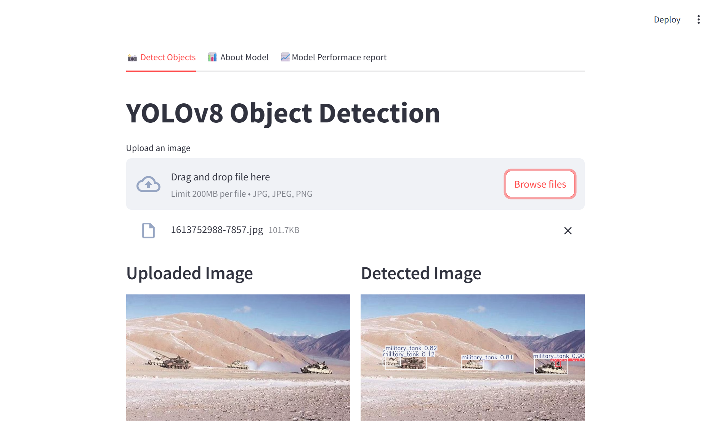

# 🛰️ Military Object Detection using YOLOv8 and Streamlit

This project showcases a powerful object detection system tailored for **military and defense-related applications**, built using the **YOLOv8** model and deployed through an interactive **Streamlit web app**.

---

## 📦 Overview

This project uses a YOLOv8-medium model trained on a custom dataset of military objects. The trained model is integrated into a user-friendly Streamlit application that allows users to upload an image and instantly see detected military objects with bounding boxes and labels.

---

## 🖼️ App Functions Preview



---

## 🎯 Use Cases

- **Reconnaissance & surveillance**
- **Threat detection in combat zones**
- **Defense system automation**
- **Military training simulations**

---

## 📁 Dataset Summary

The dataset comprises 10 object categories. 

### Classes Used:
1. `camouflage_soldier`
2. `weapon`
3. `military_tank`
4. `military_truck`
5. `military_vehicle`
6. `soldier`
7. `civilian_vehicle`
8. `military_artillery`
9. `military_aircraft`
10. `military_warship`

> Note: Classes `civilian` and `trench` were removed from training dataset due to insufficient data.

---

## 📊 Model Performance

- Model: **YOLOv8 Medium**
- Training: Custom dataset + augmentation
- mAP@0.5: **0.777**

### Class-wise mAP@0.5:
| Class               | mAP@0.5 |
|--------------------|---------|
| camouflage_soldier | 0.856   |
| weapon             | 0.705   |
| military_tank      | 0.894   |
| military_truck     | 0.751   |
| military_vehicle   | 0.657   |
| soldier            | 0.821   |
| civilian_vehicle   | 0.515   |
| military_artillery | 0.681   |
| military_aircraft  | 0.936   |
| military_warship   | 0.959   |

---

## 🚀 Streamlit App Features

- **Image Upload**: Upload `.jpg`, `.jpeg`, or `.png` files
- **Live Detection**: Real-time bounding box results using YOLOv8
- **Tabs**:
  - **📸 Detect Objects**: Run object detection on images
  - **📊 About Model**: Learn about YOLO and object detection
  - **📈 Model Performance**: View PR curves and confusion matrix

---

## 💻 Getting Started

### 🔧 Installation

```bash
git clone https://github.com/santhanvasudevan/military_object_detection.git
cd military_object_detection
pip install -r requirements.txt
```

📦 Download the trained YOLOv8 model: [Google Drive Link](https://drive.google.com/file/d/1JJ0xFgYPnb0D7iFsjFc-2ZAufK8SQiXL/view?usp=drivesdk)

> Make sure `yolov8_model.pt` (your trained model) is in the root directory.

### ▶️ Run Streamlit App

```bash
streamlit run app.py
```

---

## 📁 Project Structure

```
my_project/
├── app.py                                 # Streamlit app
├── yolov8_model.pt                        # Trained model (Download from drive link provided)
├── PR_curve.png                           # Precision-recall curve
├── confusion_matrix_normalized.png        # Confusion matrix
├── screenshot.png                         # Screenshot of app
├── requirements.txt                       # Python dependencies
└── README.md                              # Project documentation
```

---

## 🧠 Technologies Used

- Python
- Streamlit
- Ultralytics YOLOv8
- OpenCV
- Pillow

---

## 📌 Notes

- The model uses a confidence threshold of **0.10** to detect even less visible objects. (You may adjust this value based on your needs)
- Dataset was augmented using techniques like rotation, flipping, and brightness adjustment to improve generalization.

---

## 🛡️ Disclaimer

This project is for academic and research purposes only. Any use in real-world military systems must comply with relevant legal, ethical, and safety standards.

---

## 🙌 Acknowledgements

- [Ultralytics YOLOv8](https://github.com/ultralytics/ultralytics)
- [Streamlit](https://streamlit.io/)
- Open-source military datasets used for model training
